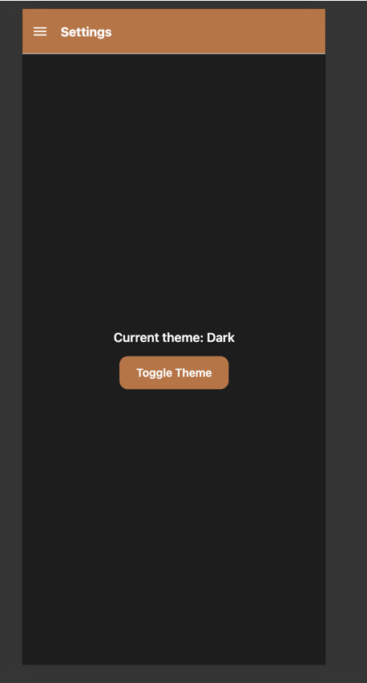
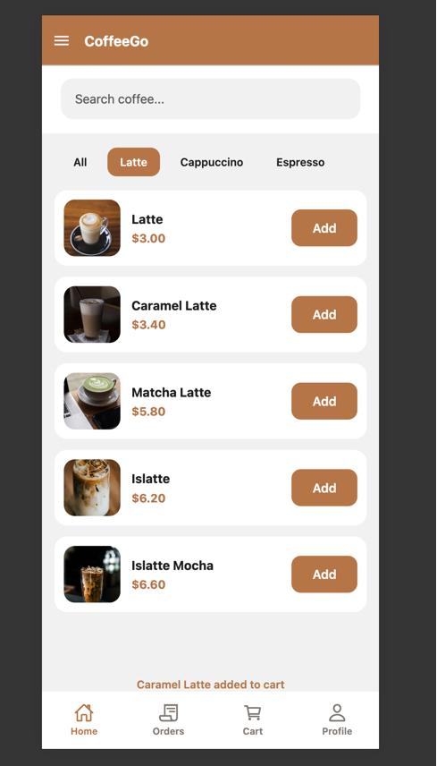
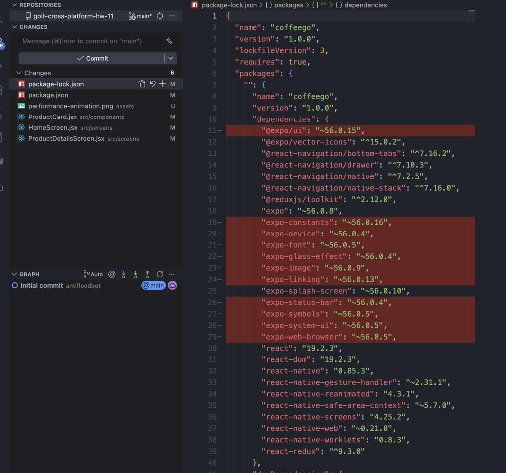

# CoffeeGo

CoffeeGo is a React Native app built with Expo and React Navigation.

The project demonstrates:
- Fetch API integration
- React Context API
- Redux Toolkit state management
- Performance optimization techniques

## API Integration

- API URL: https://api.sampleapis.com/coffee/hot
- Fetch API is used for network requests.
- API logic is isolated in `src/services/coffeeApi.js`.
- Data is normalized before rendering so screens receive consistent coffee items.
- Loading and error states are handled on the Home screen.

## Features

- Coffee list loaded from API
- Search by coffee name
- Category filtering (All, Latte, Cappuccino, Espresso)
- Product Details screen
- Drawer navigation
- Bottom tab navigation
- Size selector (S / M / L)
- Add to Cart button UI

## Data Flow

- Coffee data is fetched from the API when the Home screen loads.
- Results are stored in component state using React hooks.
- Coffee items are rendered using FlatList.
- Selecting a coffee opens Product Details and passes route parameters:
  - id
  - title
  - price
  - imageUrl
  - description

## Navigation Structure

```text
Drawer Navigator
└── Stack Navigator
    ├── Home
    ├── Product Details
    ├── Orders
    ├── Cart
    └── Profile
```

Additional Drawer Screens:
- Settings
- Help
- Contact

## Run Instructions

```bash
npm install
npm run web
```

## Screenshots

### Home Screen


### Product Details Screen


### Drawer Navigation


### Context API - Light Theme


The application uses ThemeContext and useContext to manage and switch between light and dark themes.

### Context API - Dark Theme


The application uses ThemeContext and useContext to manage and switch between light and dark themes.

### Redux Cart


The application uses Redux Toolkit for cart state management. Products can be added, removed, and their quantity can be updated.

## Performance Optimization

### Animation

- LayoutAnimation was added to ProductDetailsScreen.
- The add-to-cart confirmation message is animated when it appears and disappears.
- Android LayoutAnimation support is enabled through UIManager.

### Render Optimization

- ProductCard is wrapped with React.memo.
- HomeScreen uses useMemo for coffee filtering.
- HomeScreen uses useCallback for:
  - search handlers
  - category handlers
  - FlatList renderItem
- Render logging was added to observe ProductCard re-renders during development.

### Dependency Cleanup

- Direct dependencies were reduced from 29 to 18.
- 11 unused Expo packages were removed.
- npm run lint passed after cleanup.
- Application functionality remained unchanged after dependency removal.

## Performance Evidence

### Product Details Confirmation Animation


The add-to-cart confirmation message is animated using LayoutAnimation.

### Dependency Cleanup Result


Direct dependencies were reduced from 29 to 18 after removing unused Expo packages.

## State Management

### Context API

Implemented ThemeContext using React Context API.

Features:
- ThemeProvider wraps the application.
- Theme state is shared through useContext.
- Toggle Theme button is available on the Settings screen.
- Light and Dark themes are supported.
- Theme state is consumed by multiple components.

### Redux

Implemented Redux Toolkit for cart management.

Features:
- configureStore setup in store.js
- cartSlice created with reducers:
  - addItem
  - removeItem
  - updateQuantity
- useSelector is used to read cart data.
- useDispatch is used to update cart state.
- Products can be added from Home and Product Details screens.
- Cart screen supports quantity updates and item removal.
