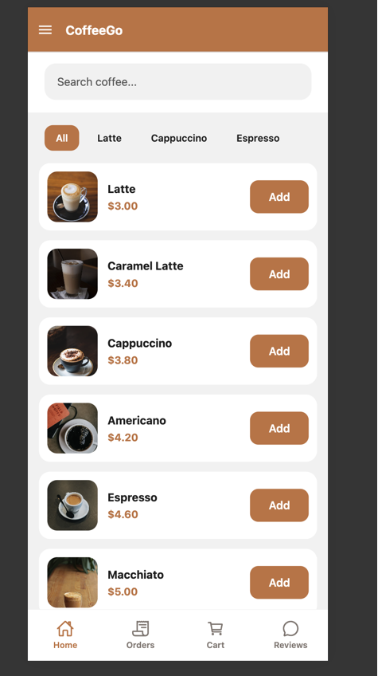
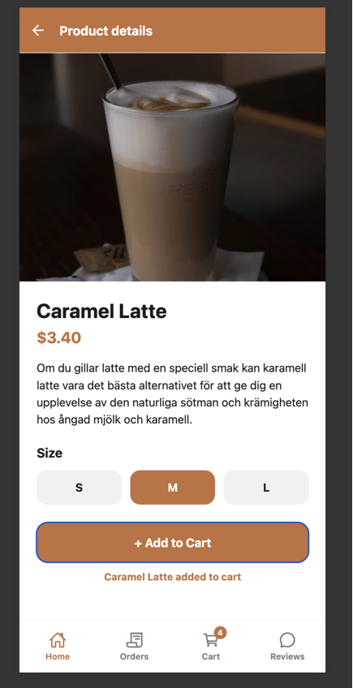
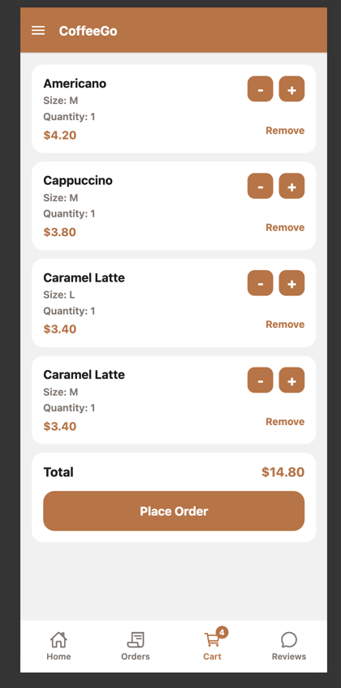
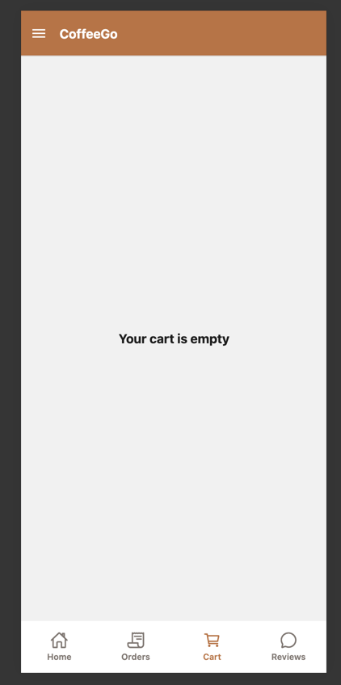
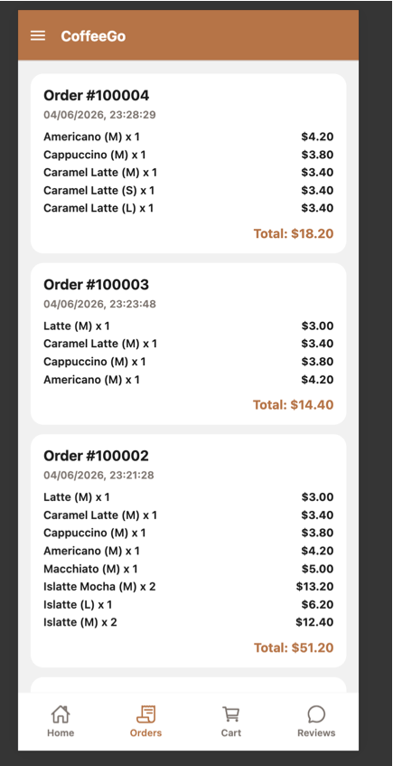
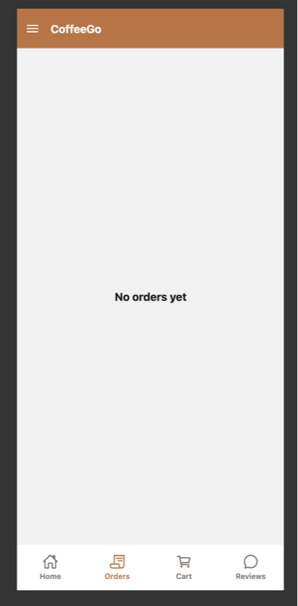
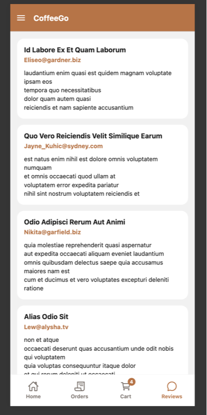
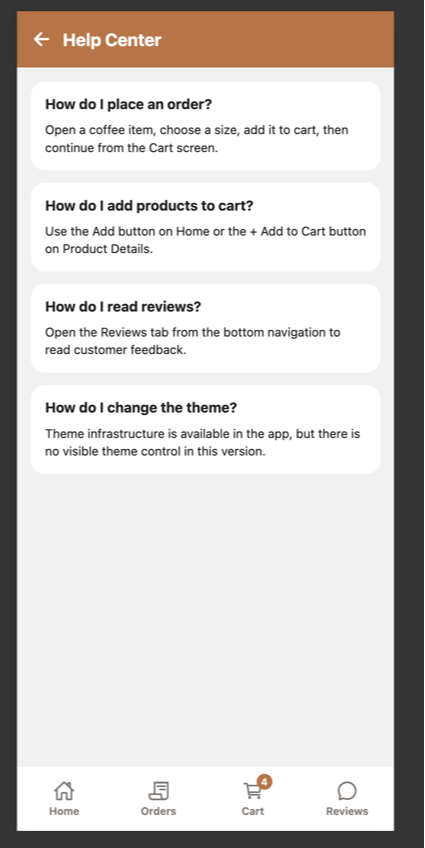
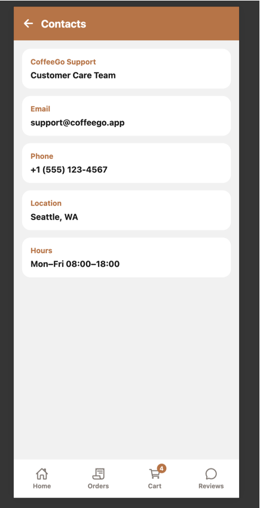
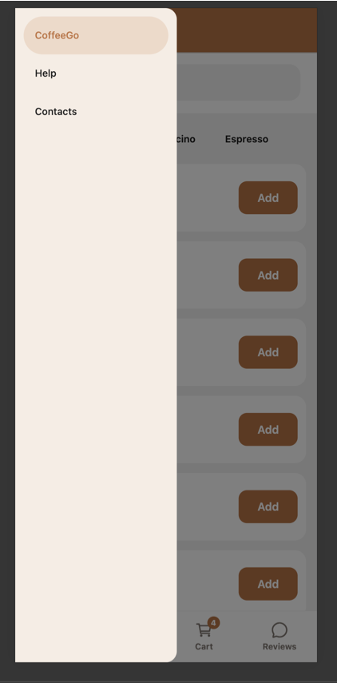

# CoffeeGo

CoffeeGo is a React Native app built with Expo and React Navigation.

The project demonstrates:
- Fetch API integration
- React Context API
- Redux Toolkit state management
- Performance optimization techniques

## API Integration

- API URL: https://api.sampleapis.com/coffee/hot
- Fetch API is used for network requests.
- API logic is isolated in `src/services/coffeeApi.js`.
- Data is normalized before rendering so screens receive consistent coffee items.
- Loading and error states are handled on the Home screen.

## Features

- Coffee list loaded from API
- Search by coffee name
- Category filtering (All, Latte, Cappuccino, Espresso)
- Product Details screen
- Drawer navigation
- Bottom tab navigation with Home, Orders, Cart, and Reviews
- Size selector (S / M / L)
- Add to Cart button UI
- Reviews loaded from an external REST API
- Orders screen with completed order history
- Cart badge with total quantity
- Cart and orders sessionStorage persistence

## Data Flow

- Coffee data is fetched from the API when the Home screen loads.
- Results are stored in component state using React hooks.
- Coffee items are rendered using FlatList.
- Selecting a coffee opens Product Details and passes route parameters:
  - id
  - title
  - price
  - imageUrl
  - description

## Navigation Structure

```text
Drawer Navigator
└── Stack Navigator
    ├── Home
    ├── Product Details
    ├── Orders
    ├── Cart
    └── Reviews
```

Additional Drawer Screens:
- Help
- Contacts

## Run Instructions

```bash
npm install
npm run web
```

## Screenshots

### Home Screen


Displays the coffee menu loaded from the external API, search input, category filters, product cards, and Add buttons.

### Product Details


Shows selected coffee details, size selection, Add to Cart action, and animated confirmation behavior.

### Cart


Shows cart items, quantity controls, item subtotals, total price, cart badge behavior, and the Place Order flow.

### Empty Cart


Shows the empty cart state after all items are removed or after an order confirmation is cleared.

### Orders


Displays completed orders with order numbers, item summaries, item subtotals, and total order amount.

### Empty Orders


Shows the empty orders state when no orders have been placed yet.

### Reviews


Displays customer reviews loaded from the external Reviews API using reusable ReviewCard components.

### Help Center


Shows FAQ cards with guidance for ordering, cart usage, reviews, and theme information.

### Contacts


Shows styled support information cards with email, phone, location, and working hours.

### Drawer Navigation


Shows the Drawer navigation with secondary sections such as Help and Contacts.

## Final Project Improvements

- Added a new Reviews screen.
- Reviews are loaded from external REST API:
  https://jsonplaceholder.typicode.com/comments
- Reviews are displayed with reusable ReviewCard component.
- Reviews screen supports loading and error states.
- Reviews screen is available from bottom tab navigation.
- Help screen was improved with FAQ cards and clearer support guidance.
- Contacts screen was improved with styled support information cards.

### Cart Badge & Session Persistence

- A live cart badge was added to the Cart tab.
- The badge displays the total quantity of products currently stored in the Redux cart.
- The badge updates immediately when products are added, removed, or quantities change.
- Cart data is persisted using browser sessionStorage.
- Cart contents are restored automatically after page refresh during the same browser session.
- sessionStorage access is safely guarded to avoid issues on Expo native platforms.

## Application Analysis

Current strengths:
- Coffee menu API integration
- Search and category filtering
- Product Details flow
- Redux cart management
- Context API theme infrastructure
- Drawer, Stack, and Tab navigation

Improvement areas:
- More product-related content
- More informative secondary screens
- Better user trust through reviews/social proof

## Final Project Decisions

- Context API is used for theme because it is lightweight global UI state.
- Redux Toolkit is used for cart because cart items require add, remove, and quantity update operations.
- Reviews API was added as a lightweight external data feature to improve user trust and content depth.
- Help and Contacts screens were expanded to replace placeholder content and improve the final project UX.
- Redux Toolkit manages cart state because multiple screens need access to cart data, badge counts, and quantity updates.

## Performance Optimization

### Animation

- LayoutAnimation was added to ProductDetailsScreen.
- The add-to-cart confirmation message is animated when it appears and disappears.
- Android LayoutAnimation support is enabled through UIManager.

### Render Optimization

- ProductCard is wrapped with React.memo.
- HomeScreen uses useMemo for coffee filtering.
- HomeScreen uses useCallback for:
  - search handlers
  - category handlers
  - FlatList renderItem
- Render logging was added to observe ProductCard re-renders during development.

### Dependency Cleanup

- Direct dependencies were reduced from 29 to 18.
- 11 unused Expo packages were removed.
- npm run lint passed after cleanup.
- Application functionality remained unchanged after dependency removal.

## Performance Evidence

- Product Details uses LayoutAnimation for the add-to-cart confirmation message.
- Direct dependencies were reduced from 29 to 18 after removing unused Expo packages.

## State Management

### Context API

Implemented ThemeContext using React Context API.

Features:
- ThemeProvider wraps the application.
- Theme state is shared through useContext.
- ThemeContext remains available as app-level theme infrastructure.
- Light and Dark themes are supported.
- Theme state is consumed by multiple components.

### Redux

Implemented Redux Toolkit for cart management.

Features:
- configureStore setup in store.js
- cartSlice created with reducers:
  - addItem
  - removeItem
  - updateQuantity
  - clearCart
- ordersSlice created for completed orders and next order numbers.
- useSelector is used to read cart data.
- useDispatch is used to update cart state.
- Products can be added from Home and Product Details screens.
- Cart screen supports quantity updates and item removal.
- Cart and order state are persisted with guarded browser sessionStorage.
